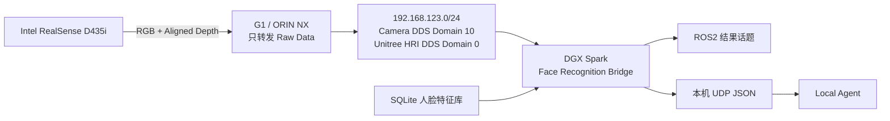

# G1 Vision：宇树 G1 人脸识别中间件

基于 [InsightFace](https://github.com/deepinsight/insightface) 的小规模开放集人脸识别项目，面向宇树机器人 G1、Intel RealSense D435i 和 NVIDIA DGX Spark 的局域网部署。

本项目不重新训练人脸模型，而是使用 InsightFace 提取归一化人脸特征，将团队成员的稳定 ID 与多个人脸模板保存在 SQLite 中。运行时从 G1 的 RGB/Depth 数据流识别人脸，并把结构化结果发布给 DGX Spark 上的本地 Agent。

> 当前状态：Windows 录入与识别 Demo、两人底库、G1 D435i RGB/Depth、DGX 推理和 Agent 原生 DDS 全链路均已完成真机验证。

真机启动、Agent 订阅、验收与故障排查见
[`docs/G1_FACE_RECOGNITION_USER_GUIDE.md`](docs/G1_FACE_RECOGNITION_USER_GUIDE.md)。

## 系统架构



硬件与网络规划：

| 设备 | 地址/接口 | 职责 |
|---|---|---|
| G1 ORIN NX | `192.168.123.164` | 发布 D435i RGB 与 Depth 原始流，不运行 AI 算法 |
| DGX Spark G1 网口 | `enP7s7` / `192.168.123.100` | 订阅 G1 ROS2/DDS 数据 |
| DGX Spark 外联网口 | `172.16.21.132` | 连接互联网、Windows 开发机与本地 Agent |
| Face Bridge | 相机 Domain `10`；Agent Domain `0` | 人脸检测、识别、深度距离估算与结果发布 |

## 已实现能力

- 多身份文件夹录入，例如 `FACE_TEAM_001`、`FACE_TEAM_002`。
- 自动选择画面中面积最大且接近中心的主脸，过滤背景小人脸。
- 对不足 15 张的身份进行轻量、确定性数据增强。
- InsightFace `buffalo_l` 检测与 512 维归一化 embedding 提取。
- SQLite 多模板人脸库和稳定的外部 `person_id`。
- 余弦相似度、`UNKNOWN` 拒识和 Top-1/Top-2 margin 判断。
- 分组留一验证：验证时同时排除原图及其增强副本，避免数据泄漏。
- ROS2 RGB/Depth 图像解析和人脸区域深度中值估算。
- ROS2 JSON 结果发布与本机 UDP Agent 输出。
- DGX Spark ARM64 Docker、Fast DDS 相机域、Unitree SDK2 Agent DDS 和双网卡配置。

## 当前验证结果

开发数据包含 001 的 15 张原图、002 的 12 张原图和 3 张轻量增强图。

| 人员 | 分组验证原图 | 正确 | 最低同人相似度 |
|---|---:|---:|---:|
| `FACE_TEAM_001` | 15 | 15 | 0.695 |
| `FACE_TEAM_002` | 12 | 12 | 0.705 |
| 合计 | 27 | 27 | 0.695 |

- 分组验证正确率：`27/27`。
- 两人之间最高错误候选相似度：`0.139`。
- 001 独立测试图：相似度 `0.896`，与 002 的 margin 为 `0.821`。
- 当前默认阈值：`0.40`；默认最小 margin：`0.05`。

这些结果只证明当前受控数据上的功能闭环，不代表生产环境准确率。进入实际 G1 场景后仍需使用真实距离、光照、运动模糊和团队外人员数据重新标定。

## 目录结构

```text
docs/
  NEW_FACE.MD                         方案与识别原理
  G1_DGX_FACE_BRIDGE.md               G1-DGX 桥接与消息结构
examples/team_face_recognition/
  team_face_demo.py                   预处理、录入、验证和单图识别 CLI
  g1_face_bridge.py                   ROS2/DDS RGB/Depth -> Agent 中间件
  test_team_face_demo.py              人脸库与匹配测试
  test_g1_face_bridge.py              RGB/Depth/UDP 桥接测试
  deploy/
    Dockerfile                        DGX Spark ARM64 运行镜像
    Dockerfile.dockerignore           排除模型、数据库和隐私数据
    compose.yaml                      host-network 常驻服务
    cyclonedds.xml                    固定使用 G1 网口 enP7s7
    .env.example                      话题和 Agent 输出配置
python-package/                       本项目使用的 InsightFace Python 包
```

人脸照片、ONNX 模型、预处理图和 SQLite 数据库不会进入 Git：

```text
face_datasets/                        本地原始人脸数据
.face_demo/                           Windows Demo 运行产物
deploy/runtime/models/                DGX 模型挂载目录
deploy/runtime/data/                  DGX SQLite 挂载目录
```

## Windows Demo

### 1. 创建环境

建议使用 Python 3.12：

```powershell
py -3.12 -m venv .venv
.\.venv\Scripts\python.exe -m pip install -e .\python-package
```

首次运行 `FaceAnalysis` 时会下载模型，也可以自行放置已获得授权的模型。

### 2. 准备数据

每个身份使用独立文件夹，文件夹名就是稳定人员 ID：

```text
face_datasets/
  FACE_TEAM_001/
    image_01.jpg
    image_02.jpg
  FACE_TEAM_002/
    image_01.jpg
  test_data/
    independent_query.jpg
```

`test_data` 会被明确排除，不会录入人脸库。

### 3. 预处理与增强

```powershell
.\.venv\Scripts\python.exe .\examples\team_face_recognition\team_face_demo.py preprocess `
  --input .\face_datasets `
  --output .\.face_demo\preprocessed `
  --augment-to 15
```

### 4. 创建 SQLite 人脸库

```powershell
.\.venv\Scripts\python.exe .\examples\team_face_recognition\team_face_demo.py enroll `
  --input .\.face_demo\preprocessed `
  --db .\.face_demo\team_faces.sqlite3 `
  --replace
```

### 5. 分组验证

```powershell
.\.venv\Scripts\python.exe .\examples\team_face_recognition\team_face_demo.py validate `
  --db .\.face_demo\team_faces.sqlite3 `
  --json-output .\.face_demo\validation.json
```

### 6. 单图识别

```powershell
.\.venv\Scripts\python.exe .\examples\team_face_recognition\team_face_demo.py recognize `
  --image .\face_datasets\test_data\independent_query.jpg `
  --db .\.face_demo\team_faces.sqlite3 `
  --output .\.face_demo\recognized.jpg `
  --json-output .\.face_demo\recognized.json
```

## DGX Spark 部署

目标环境：ARM64、Ubuntu 24.04、Docker、ROS2 Jazzy、Fast DDS。

### 1. 准备只读运行数据

```bash
cd examples/team_face_recognition/deploy
mkdir -p runtime/models/buffalo_l runtime/data

# 仅需要检测与识别模型
cp /path/to/det_10g.onnx runtime/models/buffalo_l/
cp /path/to/w600k_r50.onnx runtime/models/buffalo_l/
cp /path/to/team_faces.sqlite3 runtime/data/
```

### 2. 配置 ROS2 话题

```bash
cp .env.example .env
```

默认值：

```dotenv
ROS_DOMAIN_ID=10
CAMERA_RMW_IMPLEMENTATION=rmw_fastrtps_cpp
RGB_TOPIC=/camera/color/image_raw
DEPTH_TOPIC=/camera/aligned_depth_to_color/image_raw
RESULT_TOPIC=/ai/face_recognition/internal
MAX_RATE_HZ=5
AGENT_UDP_HOST=127.0.0.1
AGENT_UDP_PORT=17171
```

真机已确认使用上述 RGB 和对齐 Depth Topic。

### 3. 构建并启动

```bash
docker compose build
docker compose up -d
docker compose logs -f g1-face-bridge
```

容器使用 host network；相机流在 Domain 10 上使用 Fast DDS，Agent 结果由独立 relay 在 `enP7s7`、Domain 0 上使用 Unitree SDK2 原生 DDS 发布。

## Agent 接口

每次处理 RGB 帧后，桥接服务同时发布：

1. 原生 DDS `g1_hri.msg.FaceRecognition`：`rt/g1/hri/vision/face_recognition`（Agent 正式接口）
2. ROS2 `std_msgs/String`：`/ai/face_recognition/internal`（容器内部验收接口）
2. UDP JSON：`127.0.0.1:17171`

消息示例：

```json
{
  "schema_version": 1,
  "event": "face_recognition",
  "sequence": 42,
  "timestamp_ns": 1783742400000000000,
  "source": {
    "frame_id": "camera_color_optical_frame",
    "rgb_topic": "/camera/color/image_raw",
    "depth_topic": "/camera/aligned_depth_to_color/image_raw",
    "depth_age_ms": 18.2
  },
  "faces": [
    {
      "face_index": 0,
      "person_id": "FACE_TEAM_001",
      "status": "KNOWN",
      "similarity": 0.896117,
      "margin": 0.821183,
      "reason": "matched",
      "det_score": 0.781573,
      "bbox": [694.07, 999.25, 2153.16, 3045.44],
      "distance_m": 1.42
    }
  ],
  "inference_ms": 73.5,
  "model": "buffalo_l"
}
```

服务不会向 Agent 发送原始图像或 embedding。

## 测试

```powershell
.\.venv\Scripts\python.exe -m unittest discover `
  -s .\examples\team_face_recognition `
  -p "test_*.py" `
  -v
```

当前包含 8 个单元测试，覆盖：

- SQLite 特征读写与 gallery 聚合；
- `KNOWN` / `UNKNOWN` 与 margin 匹配；
- 测试目录隔离和数据增强；
- ROS RGB 编码转换；
- `16UC1` 深度到米的转换；
- 人脸区域距离中值；
- Agent UDP JSON 发布。

## 隐私与安全

- 人脸照片和 embedding 都属于敏感生物特征数据，不应提交到 Git 或公共对象存储。
- SQLite 和模型在 DGX 上通过只读 volume 挂载。
- 对 Agent 只发布人员 ID、分数、框和距离，不发布 embedding。
- 当前方案没有活体检测，不能直接用于门禁、支付或高风险身份授权。
- 阈值必须使用团队外人员和真实机器人采集数据重新标定。

## 许可证与上游项目

本仓库基于 InsightFace 开发，并保留上游代码。InsightFace 代码采用 MIT License；训练数据、预训练模型和模型包可能具有不同的授权限制。`buffalo_l` 等模型用于商业项目之前，请根据 [InsightFace 官方说明](https://github.com/deepinsight/insightface)确认授权。

感谢 InsightFace、Unitree Robotics、Intel RealSense、ROS2 与 CycloneDDS 社区。
