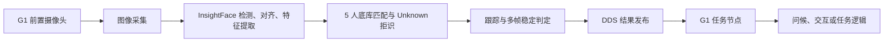

可以实现。推荐方案是：在 G1 或同网段边缘计算机上运行一个独立的“人脸识别服务”，用 InsightFace 提取特征并维护 5 人底库，再通过 DDS 向 G1 发布识别结果。

## InsightFace 有没有自带人脸 ID？

需要区分两类 ID：

- InsightFace 模型本身不会直接输出“张三/TEAM_001”这种人员 ID。
- 它输出人脸框、关键点和人脸特征向量 `normed_embedding`，再由应用程序和人脸底库做 1:N 匹配。
- 你当前这份 InsightFace 代码已经包含 People Library：SQLite 中有 `people.id`、`face_samples.person_id` 和 embedding，并支持 1:N 搜索。[storage.py](C:/Users/coldm/Documents/insightface/python-package/insightface/gui/core/storage.py:63) [recognition.py](C:/Users/coldm/Documents/insightface/python-package/insightface/gui/core/recognition.py:43)
- 但当前 GUI 的实时摄像头识别循环尚未启用，所以机器人端需要单独实现实时服务，不能直接把现有 GUI 当作运行节点。[camera_recognition_page.py](C:/Users/coldm/Documents/insightface/python-package/insightface/gui/pages/camera_recognition_page.py:13)

因此，人员 ID 应由我们定义，例如：

```text
TEAM_001 -> 成员A
TEAM_002 -> 成员B
TEAM_003 -> 成员C
TEAM_004 -> 成员D
TEAM_005 -> 成员E
```

不要直接把 SQLite 自增 ID 当作长期外部 ID；数据库重建后它可能变化。

## 推荐架构



推荐部署组合：

- G1 前置摄像头：使用 Unitree SDK2 官方相机接口获取 JPEG/OpenCV 图像。
- 人脸服务：Python、InsightFace、ONNX Runtime。
- 通信：优先直接使用 `unitree_sdk2_python` 的 CycloneDDS。
- G1 消费节点：订阅识别结果，然后触发问候、语音或业务状态机。
- 不让人脸识别结果直接控制底层关节或电机。

Unitree 官方 Python SDK 已提供前置摄像头示例、自定义 DDS 数据类型及发布订阅机制，适合这一架构。[Unitree SDK2 Python](https://github.com/unitreerobotics/unitree_sdk2_python)

## 5 人录入方案

每个人建议录入 15～30 张有效样本，最好直接用 G1 实际摄像头采集：

- 正脸、左右约 15°/30°。
- 不同距离和室内光照。
- 包含日常佩戴的眼镜。
- 每张图必须只包含一个主要人脸。
- 过滤模糊、遮挡严重、人脸过小和重复帧。

录入流程：

1. 检测并对齐人脸。
2. 提取归一化 embedding。
3. 保存 `person_id + embedding + 样本质量 + 模型版本`。
4. 每人保留多模板，或者生成正脸、左侧、右侧三个代表模板。
5. 原始照片可以在录入确认后删除，只保留必要的加密特征数据和少量审计样本。

5 人规模的向量匹配开销几乎可以忽略，主要计算量在人脸检测和特征提取。

## 实时识别逻辑

不能只取最高相似度就认定为本人，必须支持 `UNKNOWN`：

```text
检测人脸
  → 提取 embedding
  → 与 5 人模板计算余弦相似度
  → Top-1 超过阈值
  → Top-1 与 Top-2 差值超过 margin
  → 最近 5 帧至少 3 帧结果一致
  → 输出 KNOWN
否则输出 UNKNOWN
```

建议：

- 推理频率：5～10 Hz，其他帧用跟踪器维持 `track_id`。
- 初始阈值可参考当前项目默认值 `0.4`，但不能直接作为最终值。[constants.py](C:/Users/coldm/Documents/insightface/python-package/insightface/gui/core/constants.py:43)
- 用团队实拍数据和若干团队外人员数据标定阈值。
- 增加 Top-1/Top-2 差值，例如初始尝试 `0.05～0.10`。
- 连续多帧确认，人员消失 0.5～1 秒后才清除状态。
- 问候动作增加冷却时间，例如同一人员 30 秒内只触发一次。
- 如果用于门禁、支付或安全授权，还需增加活体检测，普通 InsightFace 相似度不能防照片攻击。

注意：相似度是模型分数，不是“识别概率”。

## 给 G1 的结果消息

建议只发送结果，不发送人脸图像或 embedding：

```json
{
  "schema_version": 1,
  "seq": 1024,
  "timestamp_ms": 1783653200123,
  "camera": "g1_front",
  "faces": [
    {
      "track_id": 17,
      "person_id": "TEAM_003",
      "status": "KNOWN",
      "similarity": 0.63,
      "bbox": [0.31, 0.18, 0.52, 0.61],
      "stable_frames": 4
    }
  ],
  "model_version": "buffalo_l-v1",
  "gallery_version": "team-v1"
}
```

机器人内部再把 `TEAM_003` 映射为姓名或动作，减少姓名等个人信息在网络中传播。

## DDS、ROS2、UDP 怎么选

| 方式 | 适用情况 | 建议 |
|---|---|---|
| DDS | InsightFace 服务直接与 G1 SDK2 通信 | 首选，链路最短 |
| ROS2 | 已有 ROS2 导航、语音、行为树或 rosbag 系统 | 使用自定义 `/perception/face_recognition` 消息 |
| UDP | InsightFace 跑在独立 Windows 主机，暂时不方便部署 DDS/ROS2 | 适合 POC；需自行处理序号、超时、协议版本和心跳 |

Unitree ROS2 本身也是基于 CycloneDDS，并提供 G1 示例；若后续项目会加入导航、语音、多传感器融合，ROS2 会更利于扩展。[Unitree ROS2](https://github.com/unitreerobotics/unitree_ros2)

我的具体建议是：

- 第一阶段采用 `InsightFace Python + unitree_sdk2_python + DDS`。
- 相机图像通过官方接口进入识别服务。
- 自定义 DDS Topic，例如 `g1/perception/face_recognition`。
- 后续如果整个机器人应用转向 ROS2，只替换通信适配层，录入库和识别核心保持不变。
- UDP 仅作为外部 Windows 工作站调试通道，不作为最终主链路。

最后需要注意许可证：InsightFace 代码是 MIT，但官方预训练识别模型的授权另行约束；当前官方说明要求就 `buffalo_l` 等开源识别模型联系项目方确认授权。如果机器人项目涉及商业展示或产品化，应在上线前处理模型许可。[InsightFace 官方说明](https://github.com/deepinsight/insightface)

---

你的意思是不需要训练，只需要用insightface 提取5个队员的人脸特征，存储到 SQLite 里，然后在应用的时候，再根据拍摄到的人脸，去比对人脸库里的特征，从而判断是谁？

---

对，完全正确。对于 5 人规模，通常不需要重新训练 InsightFace。

流程是：

```text
录入阶段：
队员照片
→ InsightFace 检测、对齐人脸
→ 提取 embedding 特征向量
→ 保存 person_id + embedding 到 SQLite

识别阶段：
G1 摄像头画面
→ 检测人脸
→ 提取新的 embedding
→ 与 SQLite 中 5 人的特征计算余弦相似度
→ 超过阈值则返回人员 ID，否则返回 UNKNOWN
```

需要注意三点：

1. 每人不要只存一张照片  
   建议录入 15～30 张不同角度、距离和光照的照片。可以保留多个特征模板，也可以计算几个代表性特征。

2. “最相似”不等于“就是这个人”  
   即使 5 人中必然有一个相似度最高，也必须达到设定阈值，否则返回 `UNKNOWN`，防止陌生人被误认为队员。

3. 阈值需要标定，但不是训练模型  
   用 5 名队员和一些团队外人员的实拍数据测试，确定合适的相似度阈值、Top-1/Top-2 差值以及多帧确认规则。

SQLite 中的数据可以类似：

```text
people
├── TEAM_001 / 队员A
├── TEAM_002 / 队员B
└── ...

face_embeddings
├── TEAM_001 / embedding_01
├── TEAM_001 / embedding_02
├── TEAM_002 / embedding_01
└── ...
```

最终给 G1 返回：

```json
{
  "person_id": "TEAM_001",
  "status": "KNOWN",
  "similarity": 0.64
}
```

或者陌生人：

```json
{
  "person_id": null,
  "status": "UNKNOWN",
  "similarity": 0.31
}
```

这实际上是一个“小规模开放集 1:N 人脸检索系统”：InsightFace负责产生人脸特征，我们实现人员库、匹配、陌生人拒识和向 G1 发送结果。